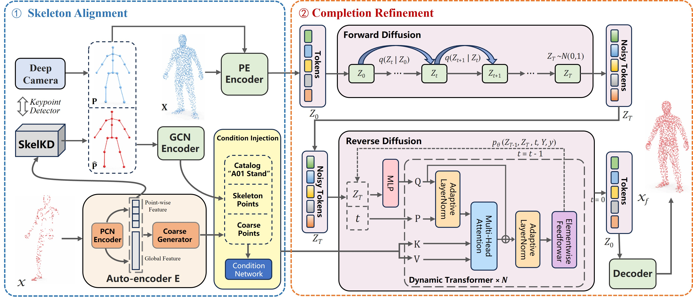

# PRISM: Human Point Cloud Reconstruction via Skeleton-Guided Diffusion from mmWave Radar

<p align="center">
  <a href="https://mmwave-human.github.io/PRISM">Project Page</a> •
  <a href="#">Paper (Anonymous)</a> •
  <a href="https://github.com/mmwave-human/PRISM">Code</a>
</p>

<p align="center">
  
</p>

> **PRISM** (**P**oint cloud **R**econstruction v**I**a **S**keleton-guided diffusion from **M**mWave radar) is a conditional latent diffusion framework for complete human point cloud reconstruction from sparse mmWave radar observations (50–150 points/frame). PRISM recovers topologically correct, action-specific, temporally consistent human point clouds guided by cross-modal skeleton alignment and a 145-token dual-path condition.

---

## 📋 Abstract

mmWave radar enables all-weather, non-contact human sensing, yet its inherent sparsity of 50–150 reflections per frame severely limits downstream body analysis. Existing point cloud completion methods target dense rigid-object inputs and fundamentally fail under the combination of extreme sparsity and non-rigid topological variability of human bodies.

We present **PRISM**, a conditional latent diffusion framework for human point cloud reconstruction from sparse mmWave radar. SkelKD aligns noisy depth-camera skeletons to the radar coordinate frame via cross-modal attention; HierVAE then encodes the sparse input into compact 8×120 latent tokens through a six-level hierarchical VAE. GeoAE simultaneously extracts a stable 128-point coarse geometric proxy from the raw mmWave cloud; together with skeleton topology via a graph convolutional network and action class label, this assembles a 145-token conditioning sequence that guides a Dynamic Transformer to denoise the latent representation under a VP-SDE framework.

On MM-Fi, PRISM significantly outperforms point cloud completion and generative baselines on MMD-CD, COV-CD, and 1-NN-CD metrics while producing temporally consistent, action-specific human point cloud sequences. We further contribute **OccluRadar-Human**, the first dataset providing paired complete and occluded mmWave captures with frame-level 3-D skeleton ground truth.

---

## 🏗️ Architecture

```
mmWave PC ──→ [GeoAE] ──→ Coarse C (128 pts)
    │                              ↓
    └──→ [SkelKD] ← Depth Skel ──→ P̂ (17 joints)
              │                    ↓
         [HierVAE Enc]    [Condition Network]
              ↓                    ↓
             Z₀   ──VP-SDE──→  Z_t + KV(145 tok)
                                   ↓
                        [Dynamic Transformer ×6]
                                   ↓
                        [HierVAE Dec] → X_f (256 pts)
```

**Key modules:**
- **SkelKD**: Cross-modal attention that refines depth-camera skeletons to radar coordinate frame without explicit calibration
- **HierVAE**: 6-level hierarchical VAE encoding sparse point clouds to 8×120 structured latent tokens
- **GeoAE**: Geometric auto-encoder producing 128 stable coarse points as geometric proxy
- **Condition Network**: Dual-path 145-token K/V sequence (17 skeleton GCN tokens + 128 coarse geometry tokens + action label)
- **Dynamic Transformer**: 6-block denoising network with VP-SDE and AdaLayerNorm conditioning

---

## 🗂️ Dataset

### MM-Fi

We use the [MM-Fi dataset](https://ntu-aiot-lab.github.io/mm-fi) as our primary benchmark.

**Experimental protocol:**

| Split | Subjects | Actions |
|-------|----------|---------|
| Train | S01–S07  | A03, A12, A13, A17, A19, A22, A26, A27 |
| Val   | S08–S10  | A03, A12, A13, A17, A19, A22, A26, A27 |

**Action descriptions:**

| ID  | Description            | ID  | Description       |
|-----|------------------------|-----|-------------------|
| A03 | Chest expansion (vertical) | A19 | Picking up things |
| A12 | Squat                  | A22 | Kicking (left)    |
| A13 | Raising hand (left)    | A26 | Jumping up        |
| A17 | Waving hand (left)     | A27 | Bowing            |

**Expected directory structure:**
```
data/
└── MMFi/
    └── E01/
        ├── S01/
        │   ├── A03/
        │   │   ├── mmwave/       # raw .bin files (TI IWR6843 UART format)
        │   │   ├── lidar/        # .npy point clouds
        │   │   └── skeleton/     # .npy joint coordinates (17 joints)
        │   └── ...
        └── ...
```

### OccluRadar-Human *(Coming Soon)*

A self-collected dataset featuring paired complete/occluded mmWave point clouds with synchronized 3-D skeleton annotations for through-obstacle evaluation. To be released upon paper acceptance.

---

## 🚀 Getting Started

### Installation

```bash
git clone https://github.com/mmwave-human/PRISM.git
cd PRISM

conda create -n prism python=3.8
conda activate prism

pip install -r requirements.txt

cd pointnet2_ops_lib
python setup.py install
cd ..
```

### Training

PRISM follows a **4-stage progressive training** strategy:

**Stage 1: SkelKD Pre-training** (~13h on RTX 3090)
```bash
python train_SkelKD.py --save experiments
```

**Stage 2: HierVAE Pre-training** (~46h on RTX 3090)
```bash
python train_Compressor.py --save experiments
```

**Stage 3: Latent Diffusion Training** (~4h on RTX 3090)
```bash
python train_MMFi_LDT.py --save experiments
```

**Stage 4: Joint Fine-tuning** *(coming soon)*

### Evaluation

```bash
python train_MMFi_LDT.py \
    --save experiments \
    --evaluate True \
    --resume True \
    --resume_epoch 1000 \
    --run_dir experiments/Latent_Diffusion_Trainer/mmfi_YYYYMMDDHHMM
```

---

## 📊 Results on MM-Fi

| Method | Venue | Type | MMD-CD ↓ | COV-CD ↑ | 1-NN-CD ↓ | CD ↓ |
|--------|-------|------|----------|----------|-----------|------|
| PCN* | 3DV'18 | Compl. | 0.00887 | 0.0855 | 0.9994 | 0.0143 |
| PoinTr* | ICCV'21 | Compl. | 0.00813 | 0.1172 | 0.9989 | **0.0138** |
| SnowflakeNet*† | ICCV'21 | Compl. | 0.00842 | 0.1013 | 0.9991 | 0.0145 |
| LAKe-Net*† | CVPR'22 | Compl. | 0.00856 | 0.0878 | 0.9993 | 0.0147 |
| mmPoint* | BMVC'23 | Radar | 0.00877 | 0.0991 | 0.9995 | 0.0158 |
| LION*† | NeurIPS'22 | Gen. | 0.00724 | 0.1892 | 0.9813 | — |
| TIGER*† | CVPR'24 | Gen. | 0.00695 | 0.2147 | 0.9776 | — |
| **PRISM (Ours)** | — | **Gen.** | **0.00483** | **0.3748** | **0.9697** | 0.0173 |
| LiDAR GT (Oracle) | — | — | — | 1.000 | 0.500 | 0.000 |

*\* Adapted to mmWave 256-pt input. †: estimated, verification ongoing.*

---

## 📁 Repository Structure

```
PRISM/
├── datasets/
│   └── MMFiViPC.py           # MM-Fi dataloader (mmWave + LiDAR + Skeleton)
├── model/
│   ├── SkelKD/
│   │   └── Network.py        # SkelKD cross-modal skeleton detector
│   ├── Compressor/
│   │   └── Network.py        # HierVAE encoder + decoder
│   ├── GeoAE/
│   │   └── Network.py        # Geometric auto-encoder (mmWave → 128 coarse pts)
│   └── scorenet/
│       └── score.py          # Condition Network + Dynamic Transformer
├── completion_trainer/
│   ├── SkelKD_Trainer.py
│   ├── Compressor_Trainer.py
│   └── Latent_SDE_Trainer.py
├── train_SkelKD.py
├── train_Compressor.py
├── train_MMFi_LDT.py
├── baseline/
│   ├── PCN/                  # PCN adapted for mmWave
│   ├── PoinTr/               # PoinTr adapted for mmWave
│   └── mmPoint/              # mmPoint (BMVC'23) adapted for MM-Fi
└── README.md
```

---

## ⚙️ Key Configurations

| Component | Parameter | Value |
|-----------|-----------|-------|
| SkelKD | local_dim / global_dim | 128 / 256 |
| HierVAE | z_dim / z_scales / levels | 20 / 8 / 6 |
| Condition Net | KV tokens | 17 + 128 = 145 |
| Dynamic Transformer | hidden / blocks / heads | 256 / 6 / 4 |
| Diffusion | train_T / sample_steps | 1000 / 200 |
| Training | lr / batch_size | 1e-4 / 16 |

---

## 📝 Citation

```bibtex
@inproceedings{prism2026,
  title     = {PRISM: Human Point Cloud Reconstruction via
               Skeleton-Guided Diffusion from mmWave Radar},
  author    = {Anonymous},
  booktitle = {Advances in Neural Information Processing Systems},
  year      = {2026}
}
```

---

## 🙏 Acknowledgements

This work builds upon [MM-Fi](https://ntu-aiot-lab.github.io/mm-fi), [LION](https://github.com/nv-tlabs/LION), and the LDT backbone. We thank the authors for their excellent open-source contributions.
